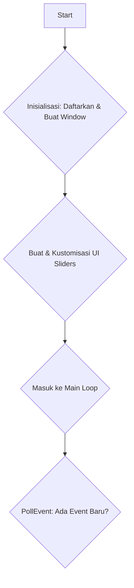

|Document|Desc|
|---|---|
|[Contributing](https://github.com/zuudevs/etherz/tree/main)|Contributing guide|
|[Code of Conduct](./CODE_OF_CONDUCT.md)|Code of Conduct|

```mermaid
graph TD
    A[Start] --> B{Inisialisasi: Daftarkan & Buat Window}
    B --> C{Buat & Kustomisasi UI Sliders}
    C --> D{Masuk ke Main Loop}
    D --> E{PollEvent: Ada Event Baru?}
```