# Architecture

## Overview

Etherz is a **header-only** C++23 networking library organized into five modules:

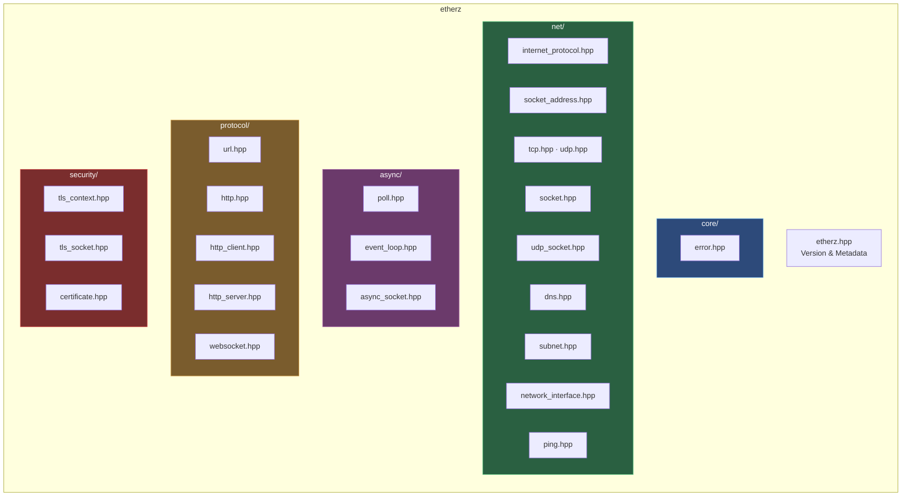

---

## Module Dependency Graph

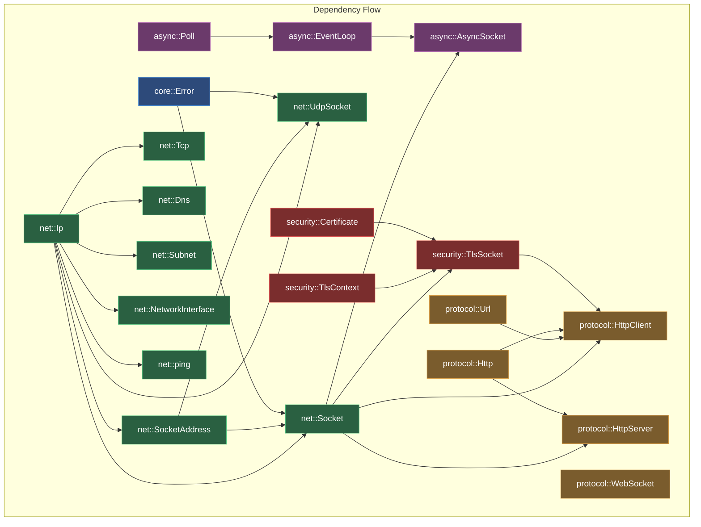

---

## Class Hierarchy

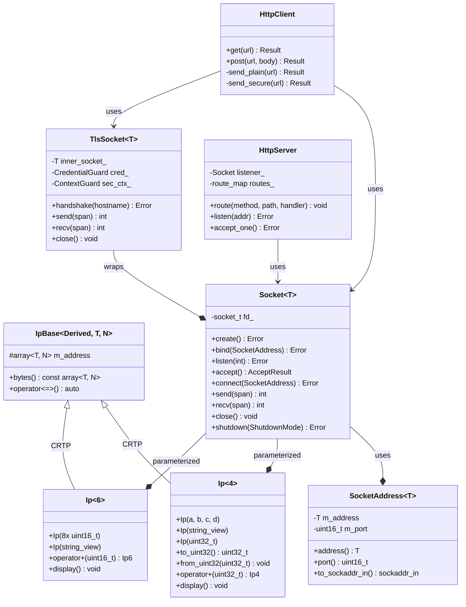

---

## TCP Connection Lifecycle

```mermaid
sequenceDiagram
    participant App as Application
    participant Sock as Socket~Ip4~
    participant OS as OS Kernel

    App->>Sock: create()
    Sock->>OS: socket(AF_INET, SOCK_STREAM)
    OS-->>Sock: fd

    App->>Sock: bind(addr)
    Sock->>OS: bind(fd, sockaddr)
    OS-->>Sock: OK

    App->>Sock: listen(backlog)
    Sock->>OS: listen(fd, backlog)
    OS-->>Sock: OK

    rect rgb(40, 80, 40)
        Note over App,OS: Accept Loop
        App->>Sock: accept()
        Sock->>OS: accept(fd)
        OS-->>Sock: client_fd + address
        Sock-->>App: AcceptResult
    end

    rect rgb(40, 40, 80)
        Note over App,OS: Data Transfer
        App->>Sock: recv(buffer)
        Sock->>OS: recv(client_fd, buf)
        OS-->>Sock: bytes_read

        App->>Sock: send(data)
        Sock->>OS: send(client_fd, data)
        OS-->>Sock: bytes_sent
    end

    App->>Sock: close()
    Sock->>OS: closesocket(fd)
    Note over Sock: RAII destructor also calls close
```

---

## TLS Handshake Flow

```mermaid
sequenceDiagram
    participant App as Application
    participant TLS as TlsSocket
    participant SCH as SChannel
    participant TCP as Socket
    participant Srv as Remote Server

    App->>TLS: handshake(hostname)
    TLS->>SCH: AcquireCredentialsHandle()
    SCH-->>TLS: CredHandle

    loop Handshake Loop
        TLS->>SCH: InitializeSecurityContext()
        SCH-->>TLS: output token + status

        alt SEC_I_CONTINUE_NEEDED
            TLS->>TCP: send(token)
            TCP->>Srv: token bytes
            Srv-->>TCP: server token
            TCP-->>TLS: recv(response)
        else SEC_E_OK
            Note over TLS: Handshake complete
        else Error
            TLS-->>App: Error::HandshakeFailed
        end
    end

    TLS->>SCH: QueryContextAttributes(STREAM_SIZES)
    SCH-->>TLS: header/trailer/max_message sizes
    TLS-->>App: Error::None

    rect rgb(40, 40, 80)
        Note over App,Srv: Encrypted Communication
        App->>TLS: send(plaintext)
        TLS->>SCH: EncryptMessage()
        TLS->>TCP: send(ciphertext)

        TCP-->>TLS: recv(ciphertext)
        TLS->>SCH: DecryptMessage()
        TLS-->>App: plaintext
    end
```

---

## HTTP Request Flow

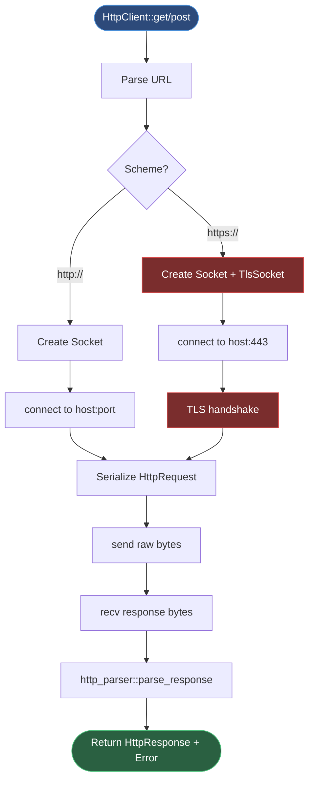

---

## Async Event Loop

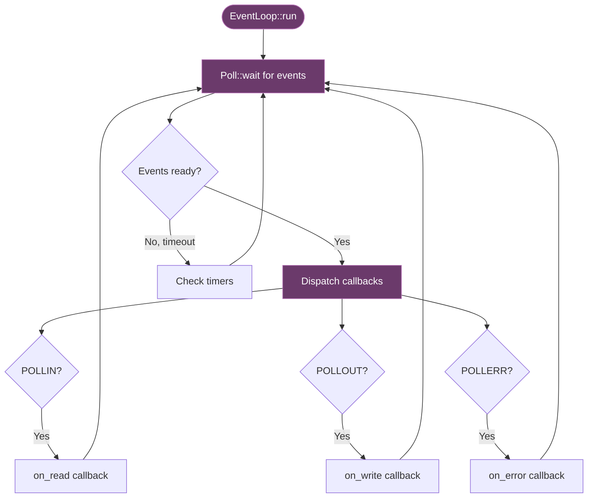

---

## DNS Resolution Flow

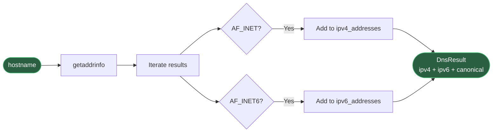

---

## Design Patterns

### CRTP (Curiously Recurring Template Pattern)

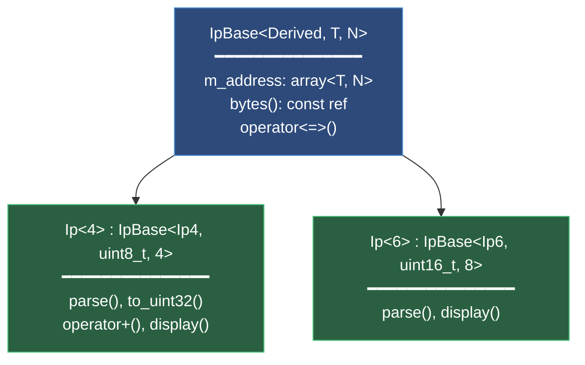

Zero-cost static polymorphism. The base class holds the address array and comparison operators; derived classes add version-specific parsing and arithmetic.

### RAII (Resource Acquisition Is Initialization)

All OS handles are managed with RAII:

| Class | Resource | Acquire | Release |
|-------|----------|---------|---------|
| `Socket` | socket fd | `::socket()` | `closesocket()` / `close()` |
| `WsaGuard` | WinSock | `WSAStartup()` | `WSACleanup()` |
| `CredentialGuard` | SSPI creds | `AcquireCredentialsHandle()` | `FreeCredentialsHandle()` |
| `ContextGuard` | Security ctx | `InitializeSecurityContext()` | `DeleteSecurityContext()` |

Move semantics supported; copy deleted on all.

### Template Specialization

```cpp
template <uint8_t Ipv> class Ip;     // Primary: static_assert guard
template <> class Ip<4> { ... };     // IPv4 specialization
template <> class Ip<6> { ... };     // IPv6 specialization
```

Invalid versions fail at compile-time via `static_assert`.

---

## Platform Abstraction

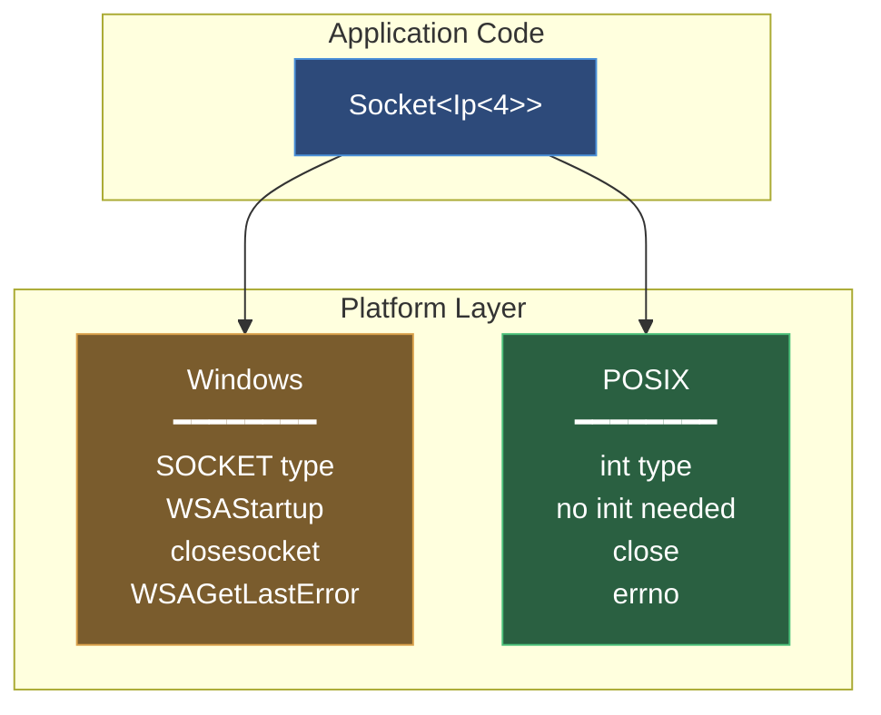

| Abstraction | Windows | POSIX |
|-------------|---------|-------|
| `socket_t` | `SOCKET` | `int` |
| `invalid_socket` | `INVALID_SOCKET` | `-1` |
| `close_socket()` | `closesocket()` | `close()` |
| `last_error()` | `WSAGetLastError()` | `errno` |
| TLS | SChannel (SSPI) | *(stub)* |
| Ping | `IcmpSendEcho` | *(stub)* |
| Interfaces | `GetAdaptersAddresses` | *(stub)* |

---

## Key C++23 Features

| Feature | Usage |
|---------|-------|
| `std::print` | Formatted output in all `display()` methods |
| `constexpr` | Nearly all constructors and operators |
| `auto operator<=>` | Three-way comparison for all value types |
| `std::integral auto` | Abbreviated function templates with concepts |
| `std::byteswap` | Network byte order conversion |
| `std::span` | Buffer views in `send()` / `recv()` |
| `std::source_location` | Test framework failure reporting |
| CTAD | Deduction guides: `Ip(a,b,c,d)` → `Ip<4>` |

---

## WebSocket Frame Flow

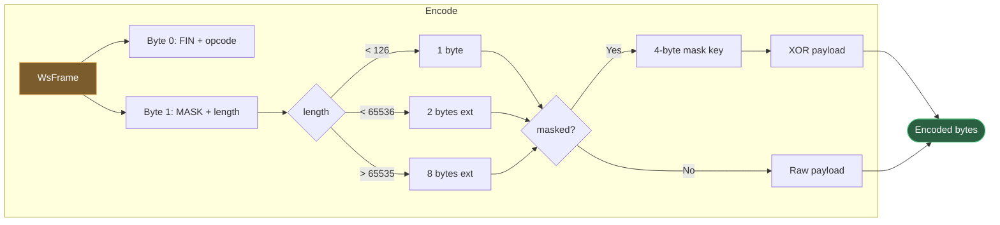

---

## Subnet Calculation

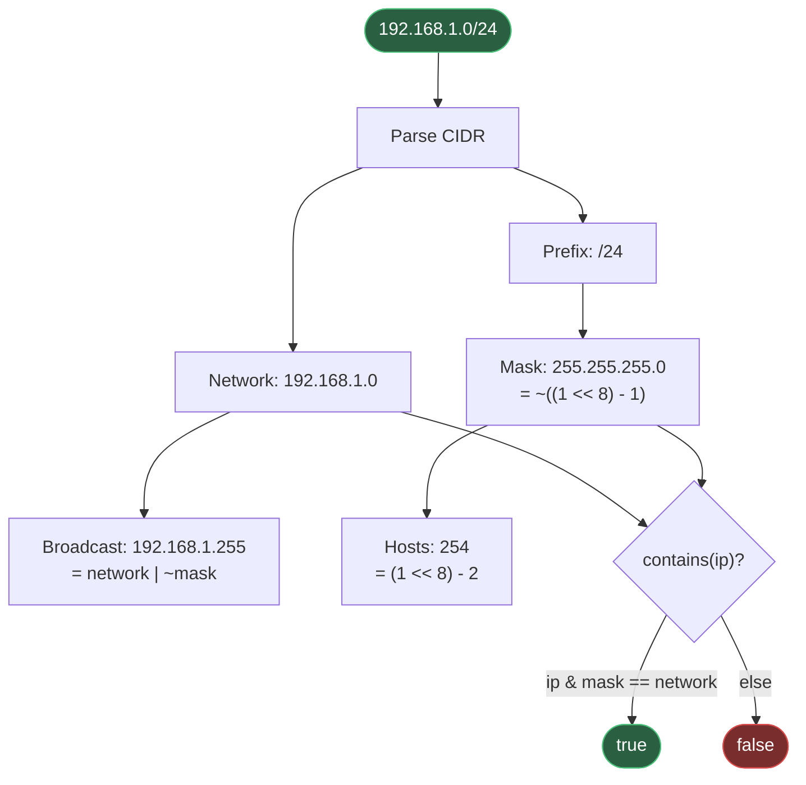
